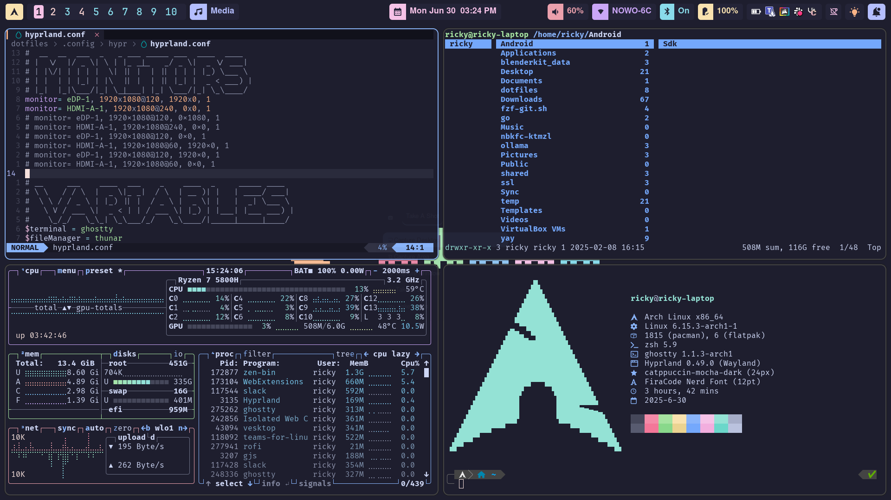

> ⚠️ **Deprecation Notice**
>
> These dotfiles are being deprecated as I am migrating my setup to **NixOS**.
>
> My new configuration (Nix-based dotfiles) can be found here:  
> 👉 https://github.com/HenriqueSFernandes/dotfiles-nix
>
> This repository is no longer actively maintained.

# Dotfiles by RICKY

Here you can find the dotfiles for my system.  
They may not be perfectly organized, but they are functional and reflect my setup.  
If you have any questions, feel free to reach out to me on [LinkedIn](https://www.linkedin.com/in/-henriquesfernandes).

📸 Screenshots  

🔥 Info

- OS: [Arch](https://archlinux.org/)
- Window Manager: [Hyprland](https://hyprland.org/)
- Terminal: [Ghostty](https://ghostty.org/)
- Shell: [Zsh](https://www.zsh.org/) with [Ohmyzsh](https://ohmyz.sh/) and [Powerlevel10k](https://github.com/romkatv/powerlevel10k)
- GTK Theme: [Catppuccin-Mocha](https://github.com/catppuccin/gtk)
- File Manager: [Thunar](https://docs.xfce.org/xfce/thunar/start)
- System Information: [Fastfetch](https://github.com/fastfetch-cli/fastfetch) / [Btop](https://github.com/aristocratos/btop)
- Top Bar: [Hypapanel](https://hyprpanel.com/)
- Launcher: [rofi](https://github.com/davatorium/rofi)
- Login Manager: [SDDM](https://github.com/sddm/sddm) with a modified version of [sugar candy](https://store.kde.org/p/1312658/)
- Text Editor: [nvim](https://neovim.io/)
- Wallpaper Manager: [waypaper](https://github.com/anufrievroman/waypaper)
- Lock Screen: [hyprlock](https://github.com/hyprwm/hyprlock)
- Idle Manager: [hypridle](https://github.com/hyprwm/hypridle)
- Printscreen Manager: [hyprshot](https://github.com/Gustash/Hyprshot)
- Color picker: [hyprpicker](https://github.com/hyprwm/hyprpicker)

🛠️ Installation Script

Soon...
