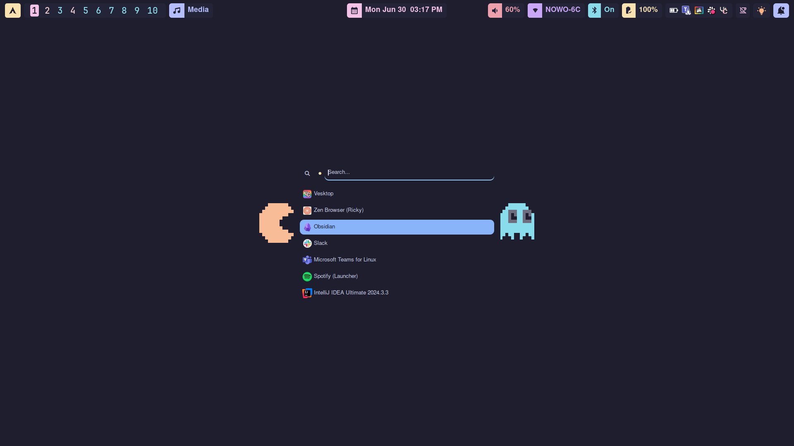

# Dotfiles by RICKY
📸 Screenshots  

🔥 Info

- OS: [Manjaro](https://manjaro.org/)
- Window Manager: [hyprland](https://hyprland.org/)
- Terminal: [kitty](https://sw.kovidgoyal.net/kitty/)
- Shell: [zsh](https://www.zsh.org/) with [ohmyzsh](https://ohmyz.sh/) and [powerlevel10k](https://github.com/romkatv/powerlevel10k)
- GTK Theme: [catppuccin-mocha](https://github.com/catppuccin/gtk)
- File Manager: [nautilus](https://apps.gnome.org/pt/Nautilus/)
- System Information: [neofetch](https://github.com/dylanaraps/neofetch) / [bashtop](https://github.com/aristocratos/bashtop)
- Top Bar: [waybar](https://github.com/Alexays/Waybar)
- Launcher: [rofi](https://github.com/davatorium/rofi)
- Login Manager: [SDDM](https://github.com/sddm/sddm) with a modified version of [sugar candy](https://store.kde.org/p/1312658/)
- Lock Screen: [swaylock-effects](https://github.com/mortie/swaylock-effects)
- Text Editors: [nvim](https://neovim.io/), [lvim](https://www.lunarvim.org/)
- Notifications: [dunst](https://github.com/dunst-project/dunst)
- Printscreen Manager: [hyprshot](https://github.com/Gustash/Hyprshot)
